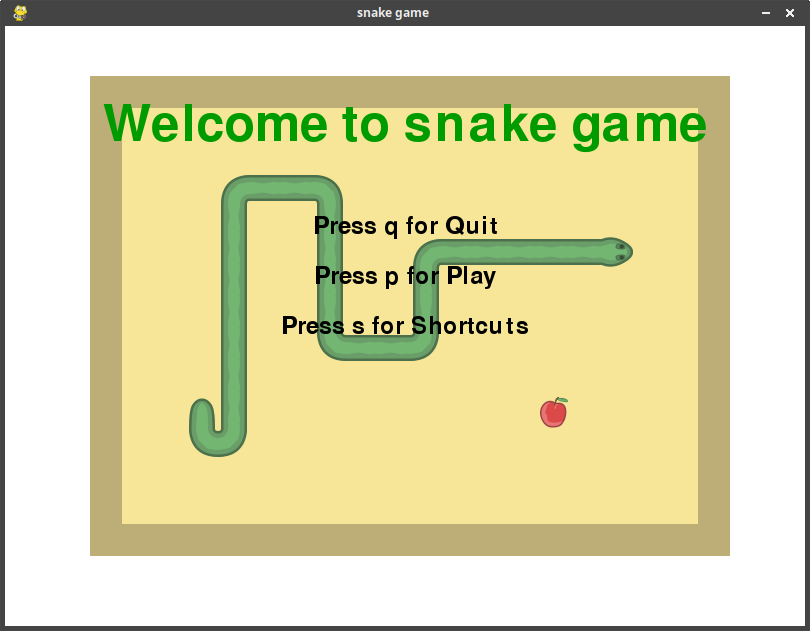
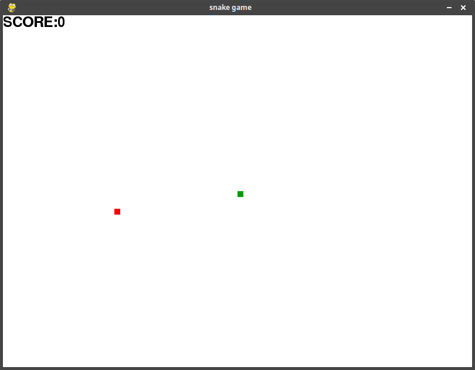
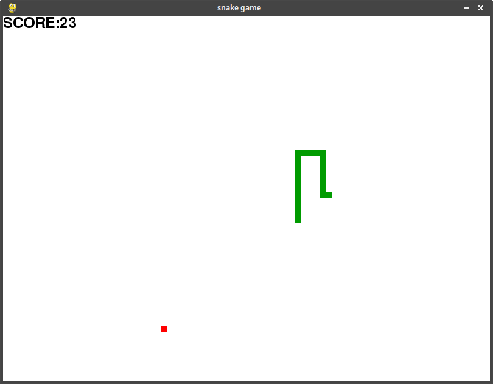

# Snake-game
A simple snake game written in [Python 3.7.1](https://www.python.org/downloads/release/python-371/)
which uses [pygame](https://www.pygame.org/news) as the renderer.

## How To Play

It is simple to get started and play. First, install the dependencies:
```
pip3 install -r requirements.txt
```
 and then run the main file.

### Installation

*Note:* You must have [installed Python3.7.1](https://www.python.org/downloads/).

How to install pygame. Open a command line and type: `pip3 install pygame`.

### Use or Play

Open a command line and run the main Python module:

```
cd src
python main.py
```

After running the Python file you will see the opening screen, with some basic
instructions on how to play the game.



If you press "s" to view the shortcuts, you will be greeted with the following
screen:


Press "e" or "h" to get back to the main screen and press "p" to play the game,
where you will see something similar to the following:



Your character, the snake, is the green dot. Your objective is to each the apples,
which are the red dots. You move using the arrows keys. Your score is in the
upper left corner of the screen, and represents how many apples you have eaten
in this round.



As you eat more apples your snake gets longer and longer, making it more difficult
to navigate around the game area. If you eat yourself or eat a wall you will get
a game over screen, and your round is over.


Once you get a game over you can play again, quit entirely, or go back to the
home screen.

## Thank you for playing!

*Feel free to update/suggest/contribute new features in game.*
